# Service Projects

Монорепозиторий с четырнадцатью самостоятельными сервисами и личными кабинетами. У каждого проекта собственный Node.js backend, SQLite-база пользователей и cookie-сессии.

## Проекты

| Проект | Назначение | Локальный порт |
|---|---|---:|
| `nodewatch-console` | Мониторинг серверов | 4173 |
| `fastletter` | Доставка документов | 4203 |
| `north-language` | Онлайн-школа языков | 4204 |
| `deskroom` | Бронирование коворкингов | 4205 |
| `green-index` | Уход за растениями | 4206 |
| `clearbook` | Бухгалтерия самозанятых | 4207 |
| `city-frame` | Архив городской фотографии | 4208 |
| `form-school` | Курсы по дизайну | 4209 |
| `rentbase` | Аренда техники | 4210 |
| `safebox` | Городское хранение вещей | 4211 |
| `pawline` | Ветеринарная клиника | 4212 |
| `veloforge` | Велосипедная мастерская | 4213 |
| `sidequest` | Платформа локальных событий | 4214 |
| `wattboard` | Домашний энергомониторинг | 4215 |

## Скриншоты

### NODEWATCH

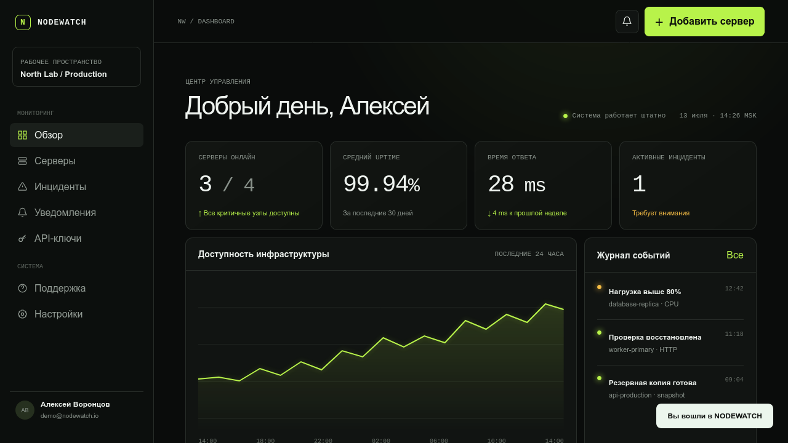

### FASTLETTER

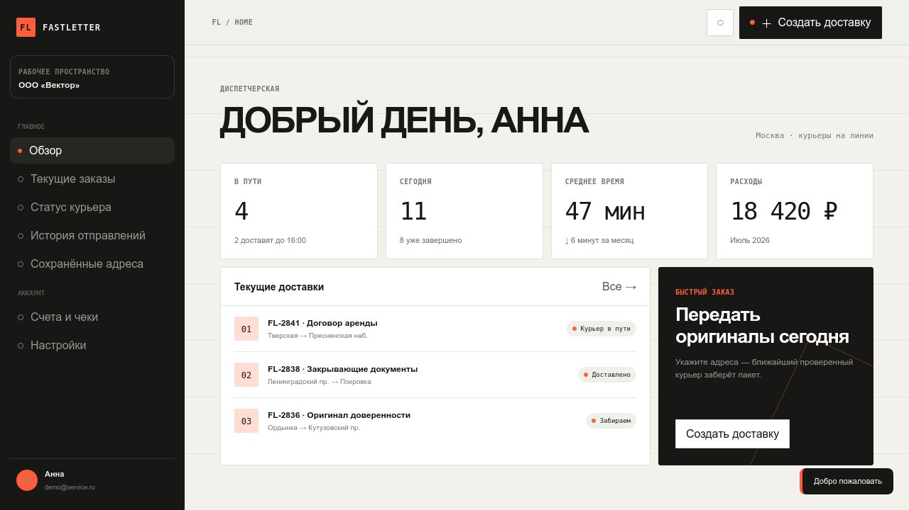

### NORTH LANGUAGE

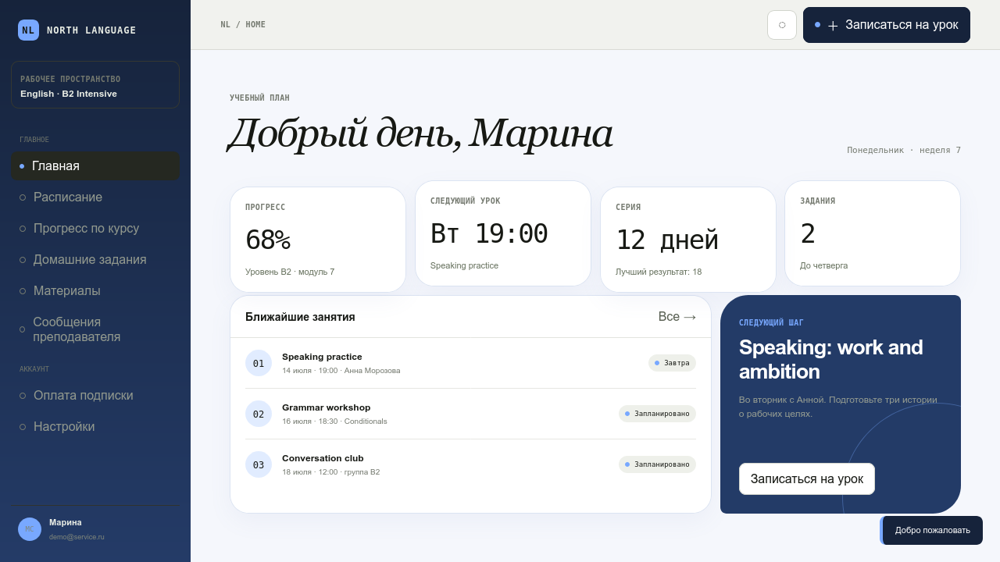

### DESKROOM

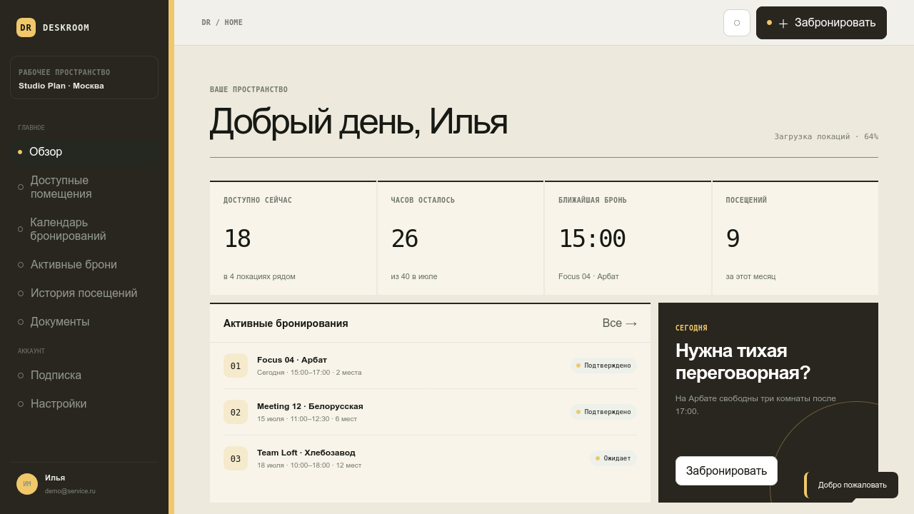

### GREEN INDEX

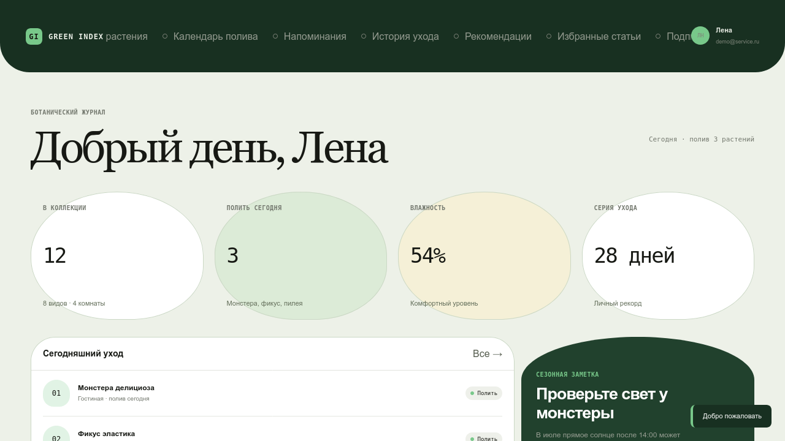

### CLEARBOOK

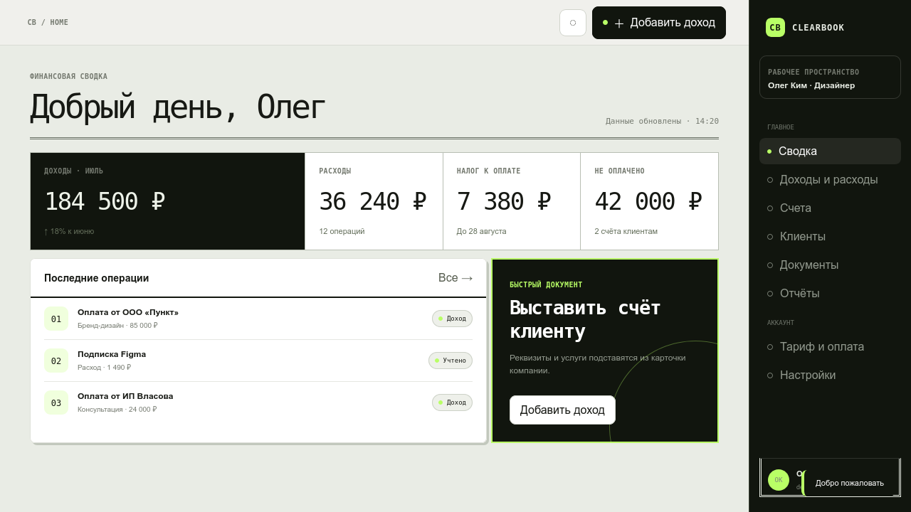

### CITY FRAME

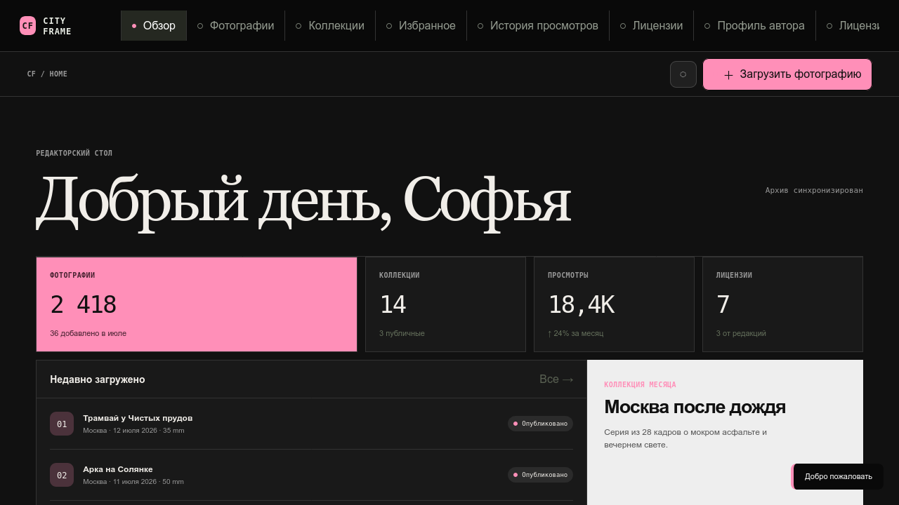

### FORM SCHOOL

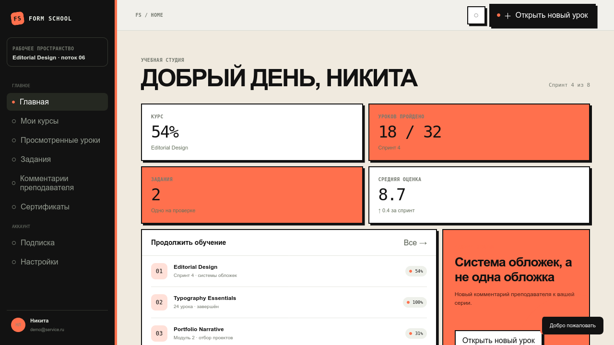

### RENTBASE

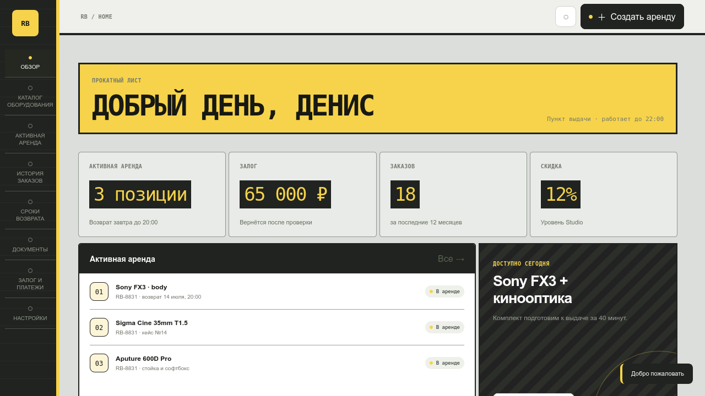

### SAFEBOX

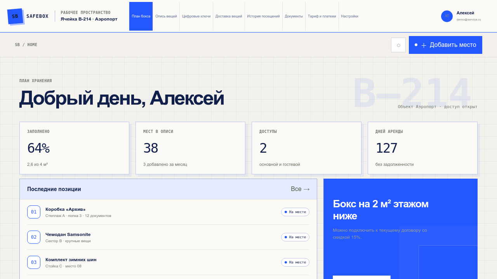

### PAWLINE

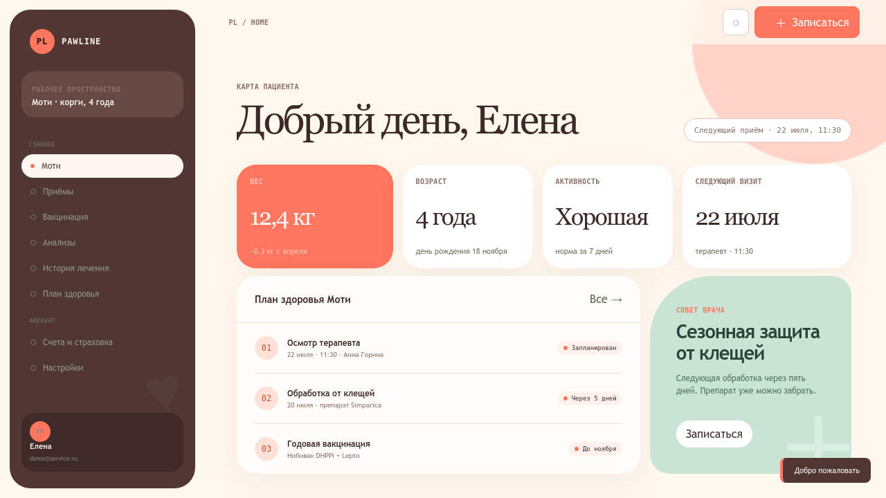

### VELOFORGE

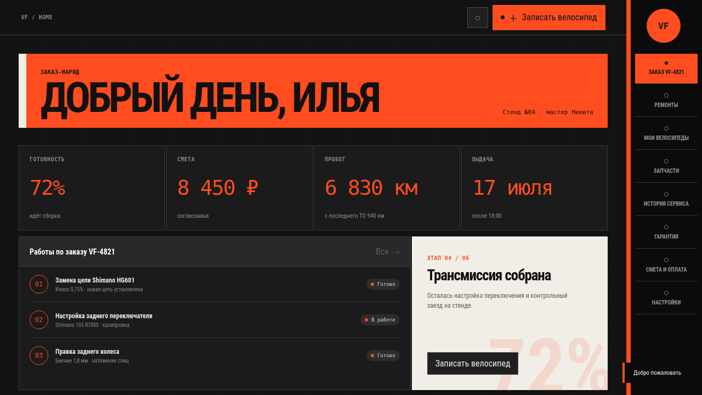

### SIDEQUEST

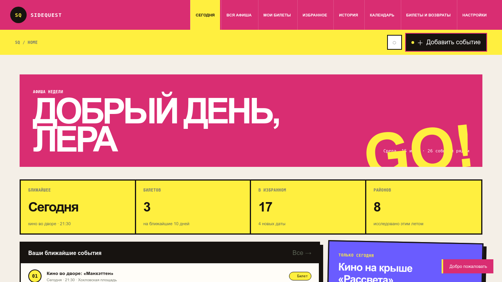

### WATTBOARD

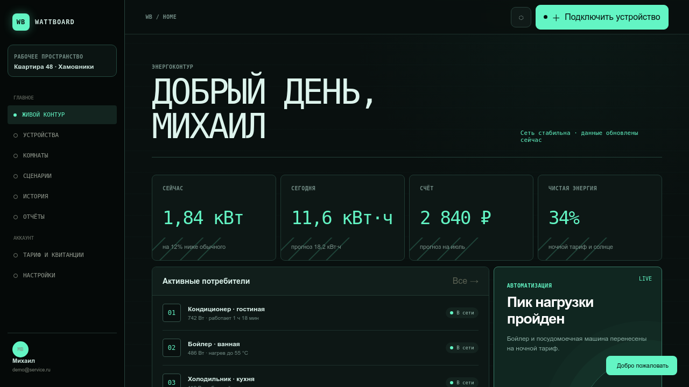

## Запуск

Из корня репозитория:

```bash
npm run dev:fastletter
```

Либо из папки конкретного проекта:

```bash
cd fastletter
npm run dev
```

Демо-вход для проектов FASTLETTER–WATTBOARD: `demo@service.ru` / `demo123`.

Демо-вход NODEWATCH: `demo@nodewatch.io` / `nodewatch`.

## Проверка

```bash
npm run check
```

Каждый проект является автономным: внутри находятся собственные `index.html`, `styles.css`, `app.js`, `server.js`, `package.json` и `README.md`.

При первом запуске backend автоматически создаёт базу `.data/app.db` и демо-пользователя. Пароли хешируются через `crypto.scrypt`, а серверные сессии передаются через `HttpOnly` cookie. Файлы баз исключены из Git.
